<div align="center">
  
# 🛒 Trimurti Kirana Stores

### Online Grocery Shopping Platform

<p align="center">
  
  
  
  
  
  
  
  
  
  
  
</p>

<p align="center">
  <b>A full-stack e-commerce web application for online grocery shopping with complete user & admin panels, order management, Razorpay payment integration, and sales analytics.</b>
</p>

<p align="center">
  <a href="#-features">Features</a> •
  <a href="#-tech-stack">Tech Stack</a> •
  <a href="#-installation">Installation</a> •
  <a href="#-screenshots">Screenshots</a> •
  <a href="#-architecture">Architecture</a>
</p>

</div>

---

## 📌 About The Project

**Trimurti Kirana Stores** is a comprehensive online grocery shopping platform that provides users with a seamless shopping experience. Built with Spring Boot and modern web technologies, this application features complete e-commerce functionality from product browsing to order placement and payment processing.

### ✨ Key Highlights

| Feature | Description |
|---------|-------------|
| 🛍️ **Complete E-commerce** | Browse, cart, checkout, order tracking |
| 👨‍💼 **Dual Panel System** | Separate User & Admin interfaces |
| 💳 **Secure Payments** | Razorpay integration + COD option |
| 📊 **Business Analytics** | Sales reports & revenue tracking |
| 🔐 **Robust Security** | Spring Security with role-based access |
| 📱 **Responsive Design** | Works on all devices |

---

## 🚀 Features

### 👤 User Panel

- ✅ User Registration & Login
- ✅ Forgot / Reset Password
- ✅ Browse Products by Category
- ✅ Product Search & Filters
- ✅ Product Details View
- ✅ Add to Cart & Cart Management
- ✅ Checkout & Order Placement
- ✅ Online Payment (Razorpay) / Cash on Delivery
- ✅ View & Track Orders
- ✅ Cancel Orders
- ✅ Profile Management

### 🔧 Admin Panel

- ✅ Admin Dashboard with Analytics
- ✅ Product Management (Add / Edit / Delete)
- ✅ Category Management
- ✅ User Management (Activate / Deactivate)
- ✅ Order Management & Status Updates
- ✅ Refund Request Management
- ✅ Sales Reports (Daily / Monthly / Quarterly / Yearly)
- ✅ Top Selling Products Report

---

## 🛠️ Tech Stack

<table align="center">
  <tr>
    <td align="center" width="100">
      
      <br><b>Java</b>
    </td>
    <td align="center" width="100">
      
      <br><b>Spring Boot</b>
    </td>
    <td align="center" width="100">
      
      <br><b>MySQL</b>
    </td>
    <td align="center" width="100">
      
      <br><b>Hibernate</b>
    </td>
    <td align="center" width="100">
      
      <br><b>Thymeleaf</b>
    </td>
  </tr>
  <tr>
    <td align="center" width="100">
      
      <br><b>Bootstrap</b>
    </td>
    <td align="center" width="100">
      
      <br><b>HTML5</b>
    </td>
    <td align="center" width="100">
      
      <br><b>CSS3</b>
    </td>
    <td align="center" width="100">
      
      <br><b>JavaScript</b>
    </td>
    <td align="center" width="100">
      
      <br><b>Razorpay</b>
    </td>
  </tr>
</table>

---

## ⚙️ Installation

### 📋 Prerequisites

| Requirement | Version |
|-------------|---------|
| ☕ Java | 17 or higher |
| 📦 Maven | 3.6+ |
| 🐬 MySQL | 8.0+ |
| 🌐 Browser | Chrome, Firefox, Edge |

### 🔧 Setup Steps

**1️⃣ Clone the Repository**

```bash
git clone https://github.com/yourusername/TrimurtiKiranaStores.git
cd TrimurtiKiranaStores
```
2️⃣ Create MySQL Database

SQL
```
CREATE DATABASE trimurti_kirana;
```
3️⃣ Configure Application Properties
```
Edit src/main/resources/application.properties:
```
properties

# Database Configuration
```
spring.datasource.url=jdbc:mysql://localhost:3306/trimurti_kirana
spring.datasource.username=your_username
spring.datasource.password=your_password
spring.jpa.hibernate.ddl-auto=update
```
# Razorpay Configuration (Optional)
```
razorpay.key.id=your_razorpay_key_id
razorpay.key.secret=your_razorpay_secret
```
4️⃣ Build and Run

```
mvn clean install
mvn spring-boot:run
```
5️⃣ Access Application

Portal	URL
🏠 User Portal	http://localhost:8080/
🔧 Admin Panel	http://localhost:8080/admin/
📸 Screenshots
🏠 Home Page
Main landing page featuring product categories, featured products, and search functionality.

<p align="center"> 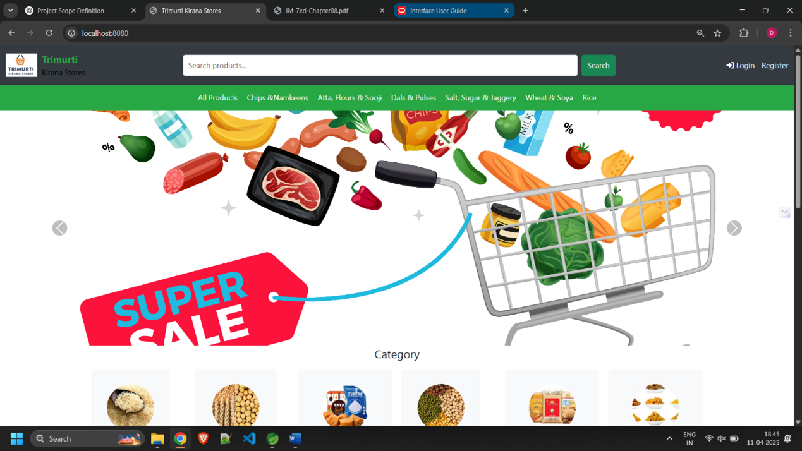 </p>
🔐 Authentication
<table> <tr> <td align="center"><b>🔑 Login Page</b></td> <td align="center"><b>📝 Register Page</b></td> </tr> <tr> <td>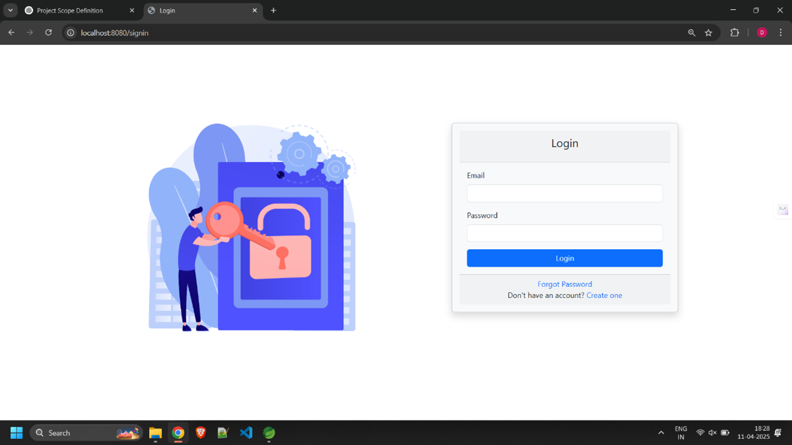</td> <td>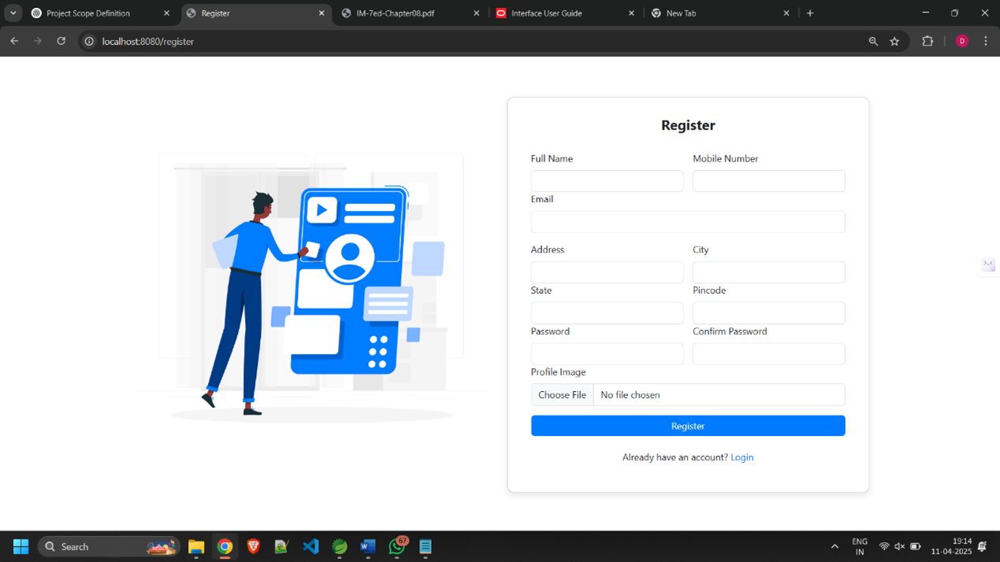</td> </tr> </table>
🛍️ Products
<table> <tr> <td align="center"><b>📋 Product Listing</b></td> <td align="center"><b>🔍 Product Details</b></td> </tr> <tr> <td>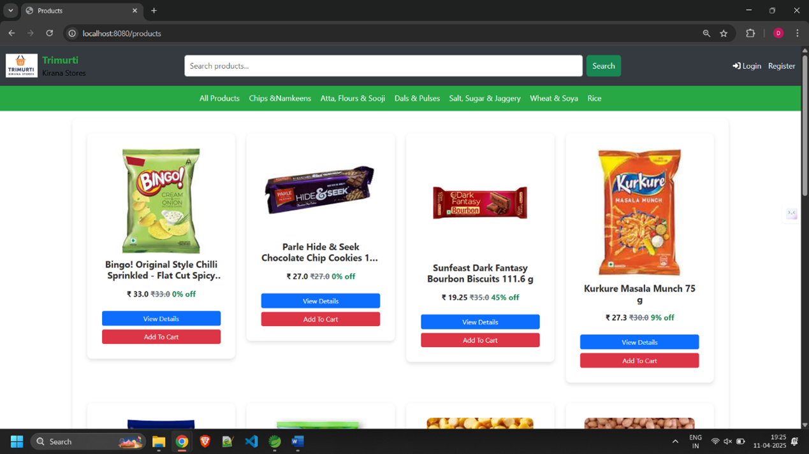</td> <td>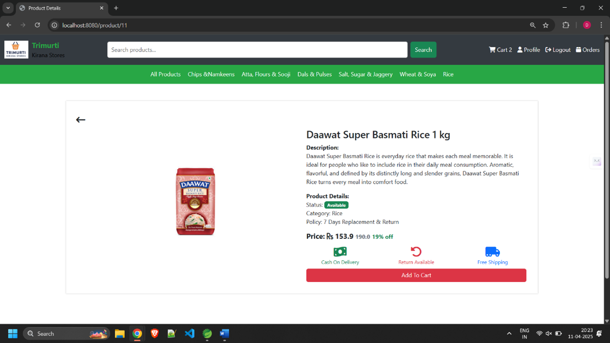</td> </tr> </table>
🛒 Cart & Checkout
<table> <tr> <td align="center"><b>🛒 Shopping Cart</b></td> <td align="center"><b>💳 Checkout Page</b></td> </tr> <tr> <td>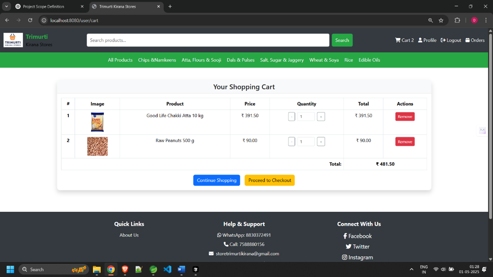</td> <td>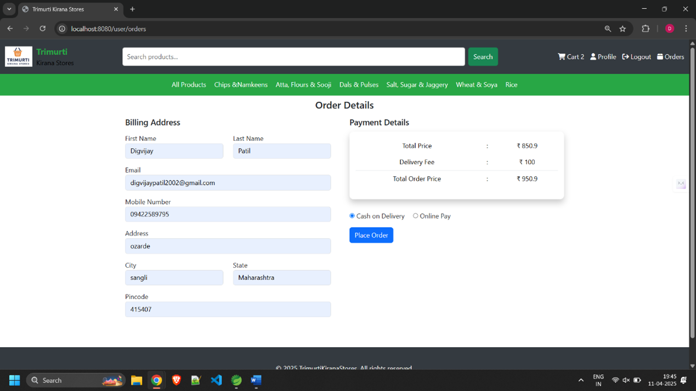</td> </tr> </table>
📦 My Orders
Order tracking with status updates and order history.

<p align="center"> 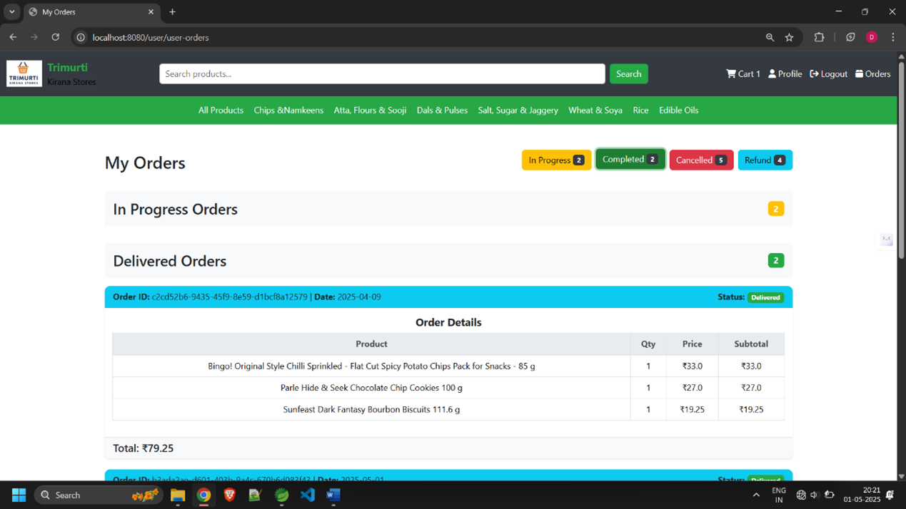 </p>
🔧 Admin Panel
<table> <tr> <td align="center"><b>📊 Admin Dashboard</b></td> <td align="center"><b>📦 Product Management</b></td> </tr> <tr> <td>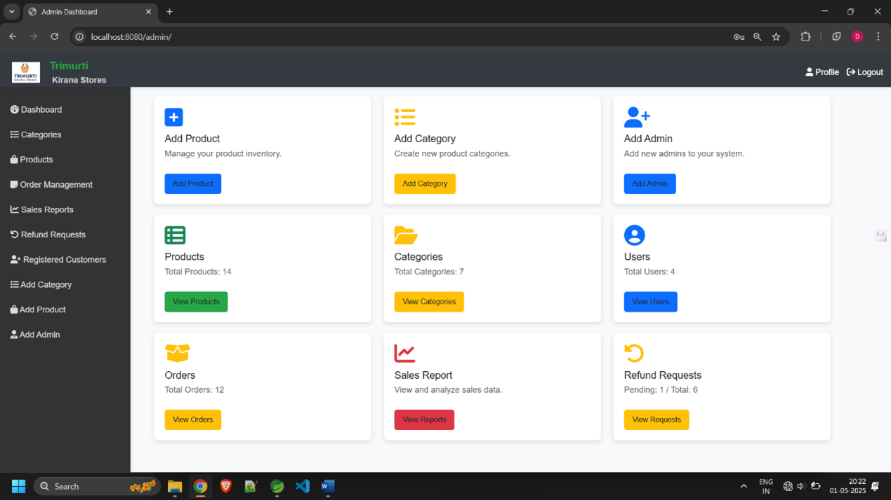</td> <td>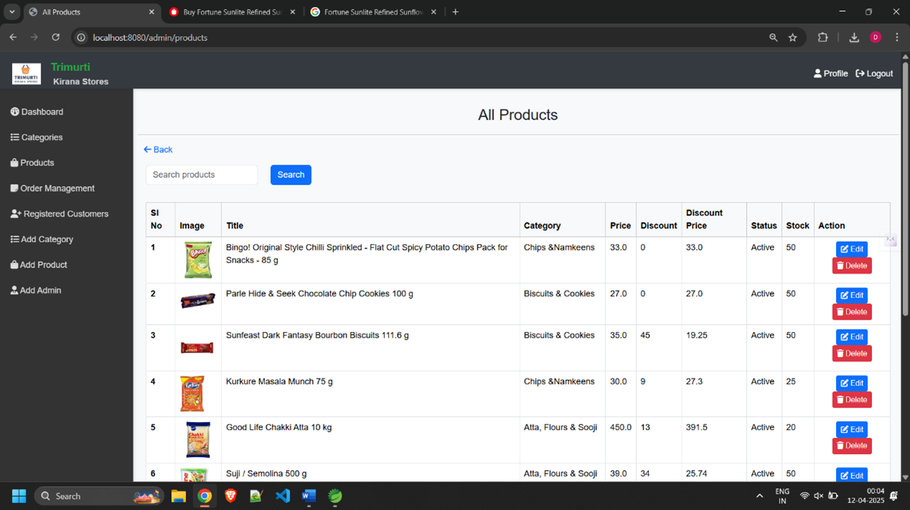</td> </tr> </table><table> <tr> <td align="center"><b>🗂️ Category Management</b></td> <td align="center"><b>📋 Order Management</b></td> </tr> <tr> <td>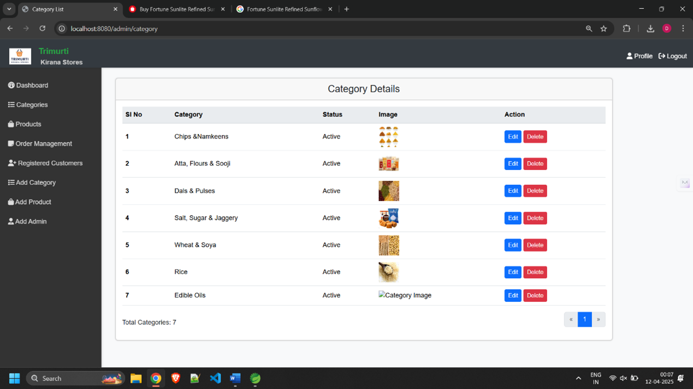</td> <td>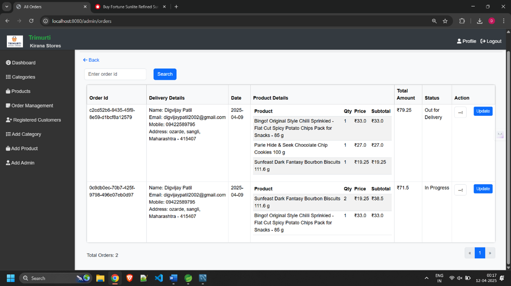</td> </tr> </table><table> <tr> <td align="center"><b>👥 User Management</b></td> <td align="center"><b>➕ Add Product</b></td> </tr> <tr> <td>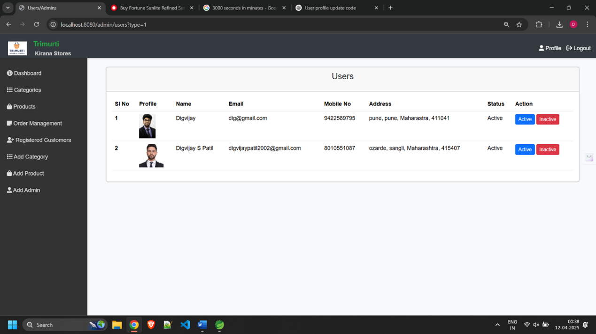</td> <td>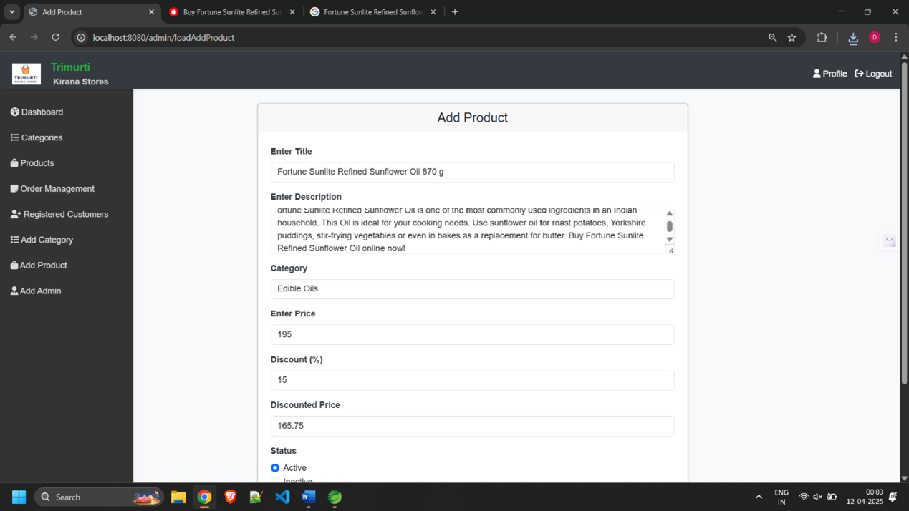</td> </tr> </table>
📊 Sales Reports
Generate daily, monthly, quarterly, and yearly sales reports with analytics.

<p align="center"> 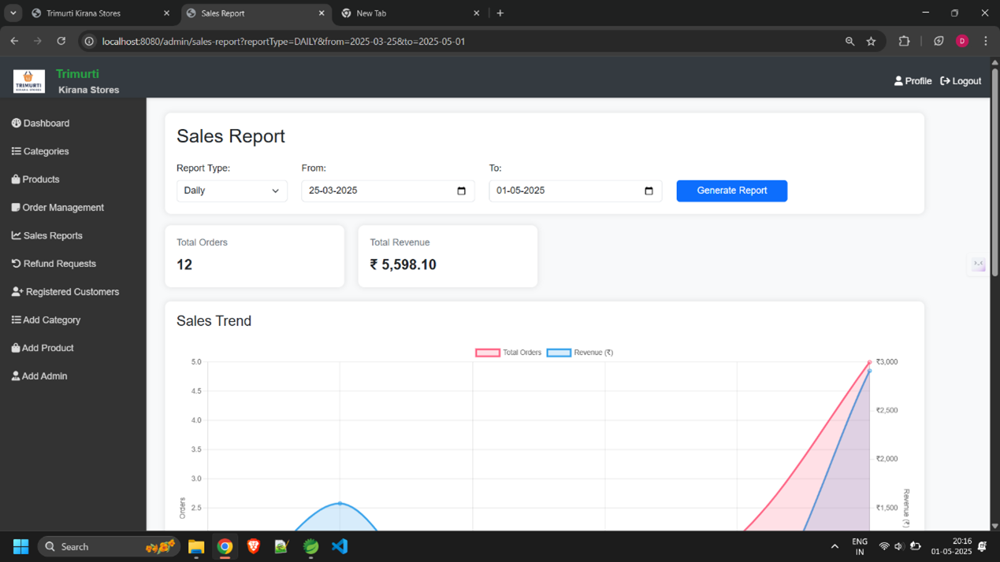 </p>
💰 Refund Management
Process and manage customer refund requests.

<p align="center"> 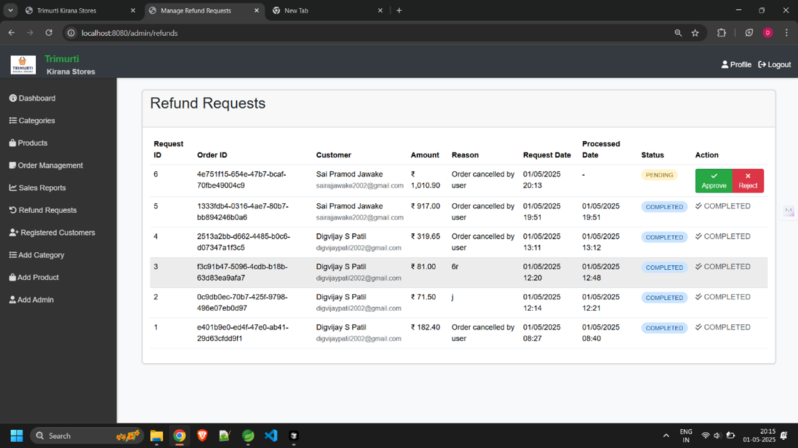 </p>
🔄 Flow Diagram
<p align="center"> 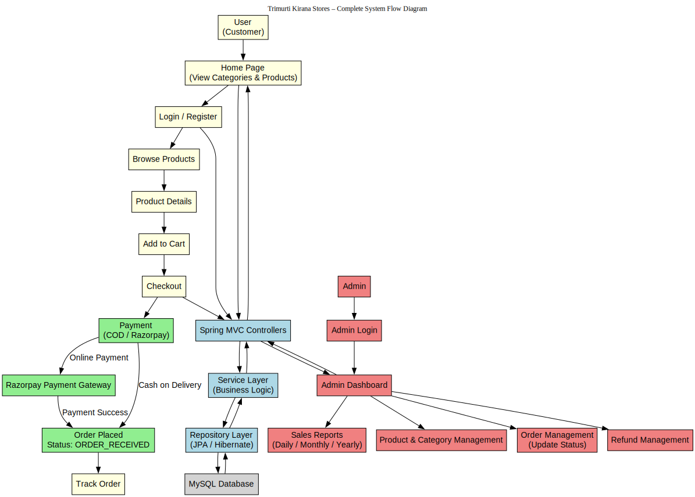 </p>
---
### 🔄 User Order Flow
<p align="center"> 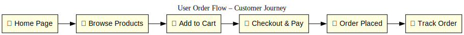 </p>
---

### 🔧 Admin Workflow
<p align="center"> 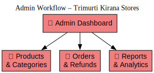 </p>
---
🤝 Contributing
Contributions are what make the open source community amazing! Any contributions you make are greatly appreciated.

🍴 Fork the Project
🌿 Create your Feature Branch
```
git checkout -b feature/AmazingFeature
```
💾 Commit your Changes
```
git commit -m 'Add some AmazingFeature'
```
📤 Push to the Branch
```
git push origin feature/AmazingFeature
```
🔃 Open a Pull Request
📧 Contact
<p align="center">
  <a href="https://www.linkedin.com/in/digvijay-patil/" target="_blank">
    
  </a>
  <a href="https://github.com/Digp12" target="_blank">
    
  </a>
  <a href="mailto:digvijaypatil2002@gmail.com">
    
  </a>
</p>
📄 License
This project is developed for educational and learning purposes.
Feel free to use it as a reference for your own projects.

<div align="center">
⭐ <b>Star this repository</b> if you found it helpful!
<br/><br/>


<br/><br/>
<b>Happy Coding! 🚀</b>
</div>
